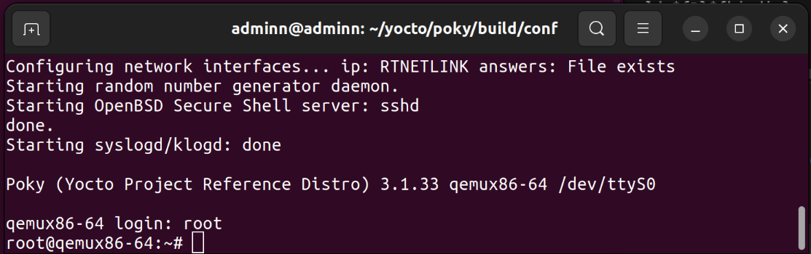
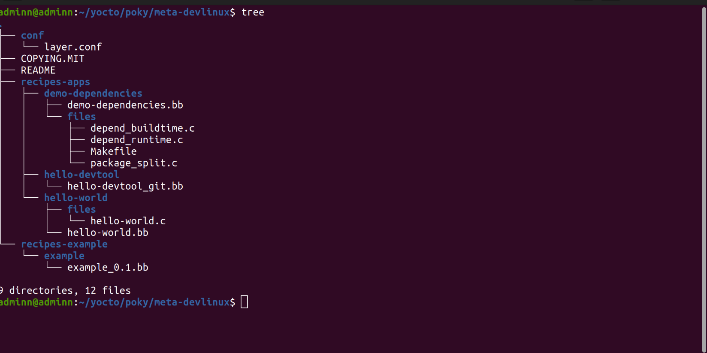
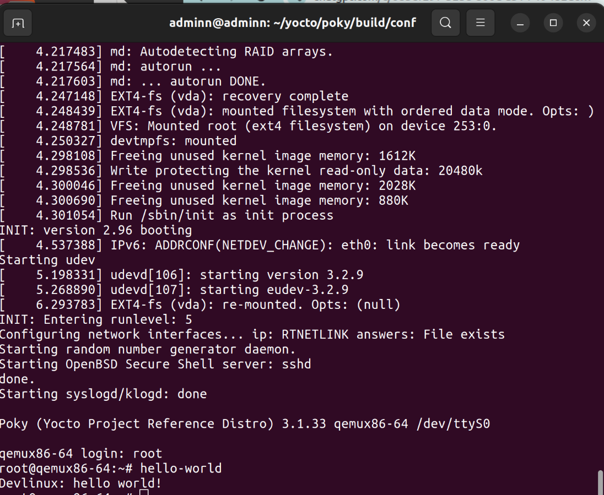
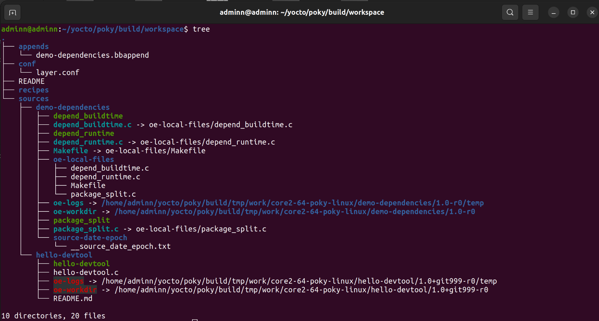
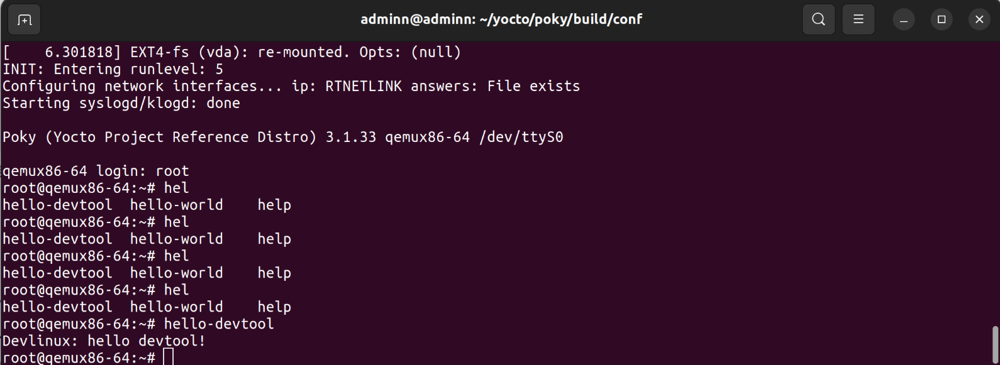
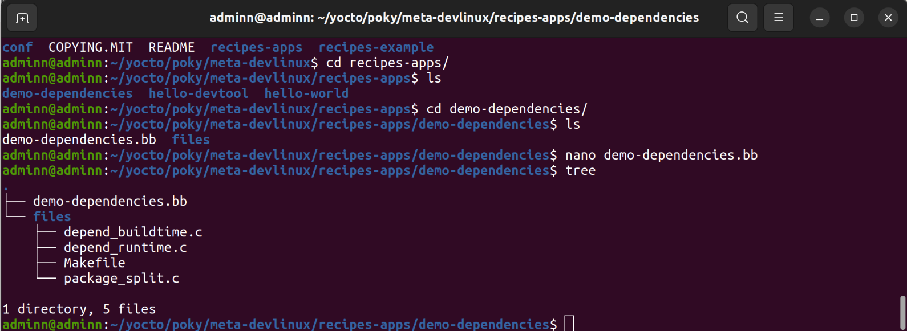
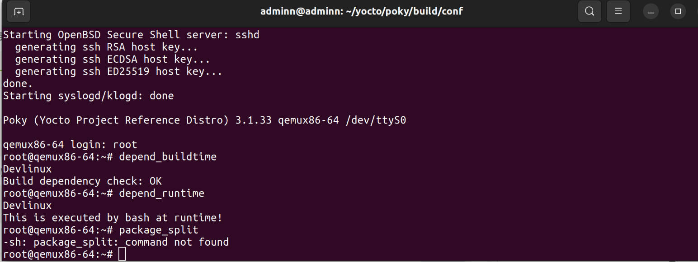
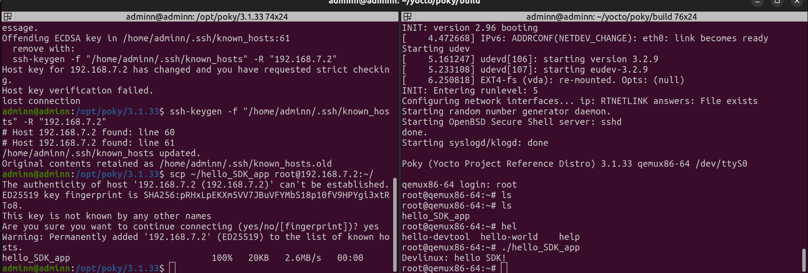
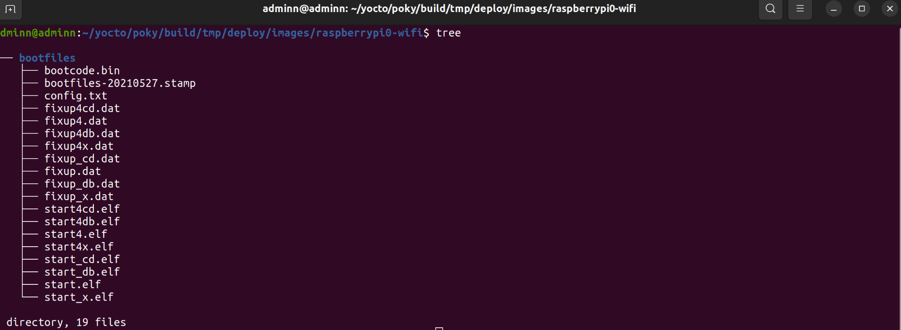

# Yocto Project 

## 1. Introduction to Yocto Project

The Yocto Project is an open-source collaboration project that provides templates, tools, and methods to help you create custom Linux-based systems for embedded devices. It is not a Linux distribution but a framework to create one.

## 2. Common Terminologies

| Term             | Description                                         |
| ---------------- | --------------------------------------------------- |
| **BitBake**      | Build engine that uses `.bb` and `.bbappend` files. |
| **Recipe (.bb)** | Script that defines how a package is built.         |
| **Layer**        | Modular collection of recipes and configurations.   |
| **Machine**      | Target hardware configuration.                      |
| **Image**        | The final built operating system image.             |

---

## 3. Run Image via QEMU
### 3.1 Installing Necessary Tools

- For Ubuntu
```bash
sudo apt-get update
sudo apt-get install gawk wget git-core diffstat unzip texinfo gcc-multilib \
     build-essential chrpath socat cpio python python3 python3-pip python3-pexpect \
     xz-utils debianutils iputils-ping libsdl1.2-dev xterm vim

```

### 3.2 Cloning the Yocto Project Repository

```bash
mkdir ~/yocto
cd ~/yocto
git clone git://git.yoctoproject.org/poky
```

### 3.3 Building an Image for QEMU
- Switch to the Appropriate Branch
```bash
cd ~/yocto/poky
git checkout dunfell
```
- Initialize the Build Environment
```bash
source oe-init-build-env
```

- Customize the Configuration Files
```bash
# poky/build/conf/local.conf
INHERIT += "rm_work"
PACKAGE_CLASSES ?= "package_rpm"


# poky/build/conf/bblayers.conf
BBLAYERS ?= " \
  /home/aosp/yocto/poky/meta \
  /home/aosp/yocto/poky/meta-poky \
  /home/aosp/yocto/meta-openembedded/meta-oe \
  /home/aosp/yocto/meta-yocto-bsp \
"
```

### 3.4 Building Image
- Open build/conf/local.conf and change the MACHINE variable to target a QEMU virtual machine with the x86-64 architecture:

```bash
MACHINE ?= "qemux86-64"
```

- Build the OS image for the QEMU virtual machine
```bash
bitbake core-image-minimal
```

### 3.5 Run the Image with QEMU
```bash
runqemu qemux86-64 nographic
```


### 3.6 Image example


## 4. Create a Simple Layer
- Set Up the Environment
```bash
# ~/yocto/poky/
source oe-init-build-env
```

- Create a New Layer
```bash
# ~/yocto/poky/build
bitbake-layers create-layer ../meta-devlinux
```

- Add the new layer to your build system
```bash
bitbake-layers add-layer ../meta-devlinux
```

- image example




---

## 5. Using Devtool
### Common Devtool Commands
- devtool add: The add command creates a new recipe from an existing source code (local or on the server). 
- devtool build: The build command is used to build recipes and test whether the software package works correctly.
- devtool deploy: Quickly test a recipe's software without rebuilding the entire image
- devtool finish: add recipe to a specific layer
- devtool modify: Edit the source code of an existing recipe in a layer.
- devtool reset: undo all changes made during the modify process
- devtool update-recipe: Update recipe when there is change in source code

### image example




---

## 6. Package dependencies and splitting
### image example





## 7. Build SDK

### image example


## 7. Build image RASPI

### image example

